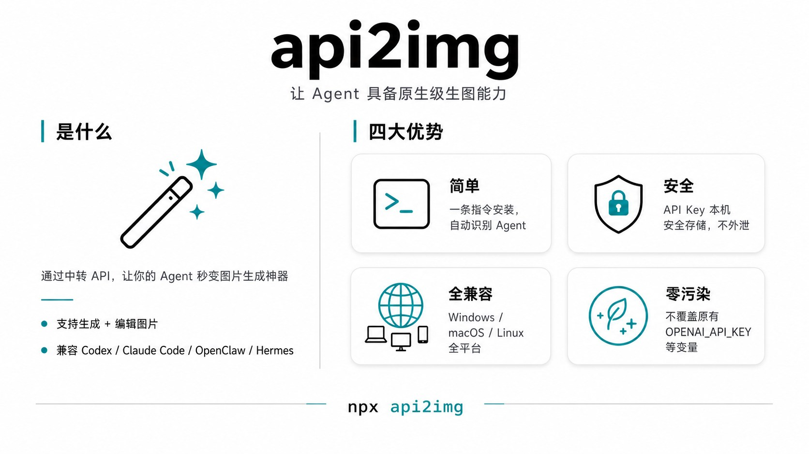

# Api2img Skill（附手动配置api接口和key教程版）

[中文](README.md) | [English](README.en.md)

## 功能

**`让任何使用非官方 API-Key 的 Agent 具备接近原生的生图能力。`**

api2img 专门面向通过中转 API 使用 Agent，同时又有图片生成和图片编辑需求的人。

支持 `Codex`、`Claude Code`、`OpenClaw`、`Hermes` 等可安装技能的 Agent，也兼容其他可手动接入的 Agent。



## 安装

复制以下指令发给 Agent：

https://github.com/loyolove/api2img-skill/
把 api2img 安装成全局技能

## 生图 API 中转商推荐
[https://a6api.com](https://a6api.com/?auth=register&aff=OqhO)

⭐️聚合中转站，汇聚很多家API，价格优惠，最低的Image2模型0.01~0.2元/张。自带路由模式，可以设置多家备选API。
- Claude Code Deepseek、qwen 各种LLM模型都有，价格也非常划算。
  
---

[https://apinebula.com](https://apinebula.com/8Rvk7M)

稳定老牌平台，主要是稳定！！！受够了个人中转站，动不动生图失败了。

- 稳定老牌平台，公司运营，可开发票
- Image2生图（0.05元/张）。
- Claude Code / Codex 都支持（价格便宜 GPT模型 0.52折）
---

## 调用方式

会在必要时自动被 Agent 调用，正常生图用也可以使用，比如：

- 【生成】生成一张xxx图
- 【修改】替换图片里的某个部分
- 【上传】修改我上传图片里的xxx

## 支持指令

用自然语言跟 Agent 说：

```powershell
安装：
- 把 api2img 安装成全局技能（默认）
- 把 api2img 安装到当前项目

配置：
- 帮我配置 api2img 的 base url
- 帮我更新 api2img 的 api key
- 帮我清空 api2img 的配置
```

## 补充一、手动创建配置文件（可选）

如果当前 PowerShell 无法使用 `npx`，也可以手动创建配置目录和文件。

### 1. 创建目录

在文件资源管理器地址栏输入：

```text
%USERPROFILE%\.api2img
```

如果目录不存在，创建：

```text
C:\Users\<你的用户名>\.api2img
```

### 2. 创建 `config.json`

在 `.api2img` 目录中创建 `config.json`：

```json
{
  "baseUrl": "https://你的api接口地址"
}
```

### 3. 创建 `secret.json`

Windows 下 api2img 通常使用文件存储 API Key。在同一目录创建 `secret.json`：

```json
{
  "apiKey": "YOUR_API_KEY"
}
```

将 `YOUR_API_KEY` 替换为真实 Key，但不要把这个文件提交到 Git。

### 手动配置后的目录结构

```text
C:\Users\<你的用户名>\.api2img\
├── config.json
└── secret.json
```

> 如果使用手动方式，请确认文件名不是 `config.json.txt` 或 `secret.json.txt`。可以在资源管理器中开启“查看 → 显示 → 文件扩展名”。
 

## 补充二、在 Codex 中直接生图

配置成功后，不需要每次手动运行命令。直接在 Codex 中描述需求即可，例如：

> 生成一张写实风格的室内植物产品广告图，暖色自然光，简约家居背景，横向构图，尺寸 1536×1024。

Codex 会根据已安装的 `api2img` 技能调用配置好的图像 API


## 隐私声明

- 本技能不会上传你的任何数据
- 生成图片时，你的提示词、上传的图片会经过你配置的三方 API 中转商，请不要处理身份证件、人脸、工作机密等各类私人敏感内容
